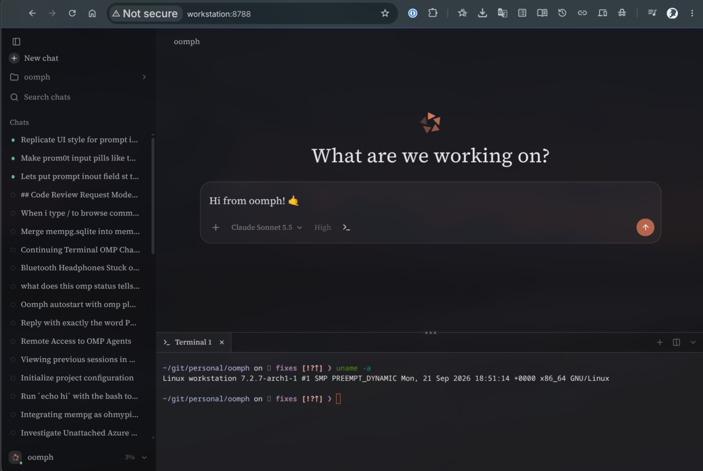

# oomph

A small web client for [omp](https://github.com/can1357/oh-my-pi), the coding agent, in your browser. You can use it from your laptop, phone, tablet, from a toilet, bus or your bed.

It is an omp plugin. Install it once, and omp can start and stop it for you.

Very much **WIP** but it works decent and will get you places.



## What you get

- Your omp chats in the browser, with the same history you see in the terminal.
- New chats in any folder, and pick up any old chat where you left off.
- Replies appear as they are written, and you can see the agent's tool steps.
- Switch the model and the thinking level.
- A terminal at the bottom of the page: click the `>_` button next to the thinking level. It opens a shell in the chat's folder, with tabs (the + button) and a split button to put two terminals side by side. Drag its top edge to make it taller or shorter, or use the arrow at the right to hide it (your terminals keep running). It uses your system's monospace font and the same environment omp was started in.
- Delete a chat you no longer need: hover it in the sidebar, click the trash icon, then click "Delete?" to confirm. It is removed from omp too, so it is gone from the terminal as well. A chat that is open in an omp window can't be deleted until you close it there.
- A login page with a password, so only you can use it.
- A clean look: A settings page (bottom of the sidebar) has light/dark mode, a dozen popular color themes, separate fonts for the interface, sidebar, replies and code, and a font size slider. Fonts come from Google by default, so the browser needs internet for them; without internet the system fonts are used. Settings are saved per browser.

## Install

```bash
omp plugin install @dzhi/oomph
```

That's it. omp needs [Bun](https://bun.sh) to install any plugin, so have `bun` installed. Once installed, oomph runs on the omp you already have and needs nothing else.

## First start

Just open omp. oomph starts with it, and the first time omp shows the address and a password:

```
oomph running at http://127.0.0.1:8788
Password: xxxxxxxxxxxxxxxxxxxxxxxx  (shown once; /oomph passwd makes a new one)
```

Save the password somewhere safe (a password manager is best). It is only shown this once. If you lose it, run `/oomph passwd` to get a new one.

Open the address in your browser, enter the password, and you're in.

## Commands

Type these inside omp:

| Command | What it does |
|---|---|
| `/oomph` | Shows if oomph is running and if autostart is on |
| `/oomph start` | Starts oomph |
| `/oomph stop` | Stops oomph |
| `/oomph restart` | Stops and starts again (use after changing settings) |
| `/oomph passwd` | Makes a new password and signs out all browsers |
| `/oomph autostart on` | Start oomph every time you open omp (the default) |
| `/oomph autostart off` | Only start oomph when you run `/oomph start` |

## How it runs

oomph starts when you open omp and stops when you close omp.

- Open several omp windows and they all share the same oomph. It stops when the **last** one closes.
- It also stops if omp crashes or its terminal window is closed.
- `/oomph stop` stops it right away.

**Terminal and browser are equal.** In the browser you can open and continue any chat, just like in the terminal:

- **A chat that's open in an omp window** runs in that omp. Messages typed in the browser show up in the terminal, and messages typed in the terminal show up live in the browser. Both see the whole conversation.
- **A chat that isn't open anywhere** runs in a background omp that oomph starts for it. If you then open that chat in a terminal (for example with `omp --resume`), the terminal takes it over and the browser follows along.
- **If you close the omp window a chat was open in** while the browser still has it open, the browser keeps going in a background omp.

Background omps stop together with oomph. Background chats that nobody is looking at are also closed after 30 minutes of doing nothing.

## Settings

Change settings from your terminal, then run `/oomph restart` in omp.

| Setting | Default | What it means |
|---|---|---|
| `host` | `127.0.0.1` | Who can reach oomph. See below. |
| `port` | `8788` | The port number in the address. |
| `autostart` | `on` | Start oomph when omp opens. Easier with `/oomph autostart on/off`. |

Examples:

```bash
omp plugin config set @dzhi/oomph host 0.0.0.0
omp plugin config set @dzhi/oomph port 9000
omp plugin config list @dzhi/oomph      # see current settings
```

## Using it from other devices

The `host` setting decides who can reach oomph.

**`127.0.0.1` (default): only this computer.** Nobody else on the network can reach it. To use it from your phone or another computer, put something in front of it that you already use, for example:

- Tailscale: `tailscale serve --bg 8788`
- Cloudflare Tunnel, ngrok, or similar
- A web server like Caddy or nginx on the same computer

**`0.0.0.0`: every network this computer is on.** Other devices can open `http://<this computer's address>:8788` directly. That works well over a private network like Tailscale, WireGuard, ZeroTier, or your home Wi-Fi.

oomph doesn't care which one you pick. Use what you already have.

## Staying safe

oomph can run commands on your computer through the agent. Treat it like a remote login.

- Keep the password secret. `/oomph passwd` changes it and signs everyone out.
- The terminal is a normal shell running as you, so anyone who can log in to oomph can run anything you can.
- oomph itself uses plain `http`, which is not encrypted. On `0.0.0.0` that's fine on a private network (Tailscale, WireGuard, home Wi-Fi you trust). Don't open the port to the public internet. If you need access from outside, use a tunnel or web server that gives you `https`.
- Too many wrong passwords make the login wait longer before the next try.

## Where things are stored

Everything lives in `~/.config/oomph/`:

- `password`: your password, stored in a form that can't be read back
- `secret`: used to keep you logged in (for 30 days)
- `server.log`: messages from the last start. Look here if `/oomph start` fails.
- `pid` and `lifeline.sock`: only there while oomph runs. omp uses them to find oomph and keep it running.

Files you attach in the chat are saved in `~/.local/share/oomph/uploads/` so older chats can still find them. oomph never deletes them; remove files there yourself when you no longer need them.

Your chats are not stored by oomph. They are omp's own chat files in `~/.omp/agent/sessions/`.

## Troubleshooting

- **"oomph failed to start"**: check `~/.config/oomph/server.log`. The most common reason is that the port is already in use. Pick another one with `omp plugin config set @dzhi/oomph port <number>`.
- **"bad origin" after login through a web server or tunnel**: your web server must pass the original site name along. Caddy and Tailscale do this by default. For nginx, add `proxy_set_header Host $host;`. Note I only access it via Tailscale and haven't actually tested it otherwise.
- **Changed a setting but nothing happened**: run `/oomph restart`.

## Update

Install the latest version:

```bash
omp plugin install @dzhi/oomph@latest
```

Then `/oomph restart` in omp.

## Uninstall

In omp, run `/oomph stop`. Then:

```bash
omp plugin uninstall @dzhi/oomph
rm -rf ~/.config/oomph     # optional: removes the password and logs
```

## Working on oomph

```bash
bun install
bun run build                # build the web page into dist/
bun run check                # the checks every pull request runs: format, lint, types, build, test
bun run format               # fix formatting
omp plugin link .            # use this folder as the installed plugin
scripts/dev.sh test 8799     # or run a separate test copy with password dev-password-123
```

`dist/` is not kept in git.

## Tech stack

- **Plugin:** an omp extension (`extension.ts`) that adds the `/oomph` command and reads its settings from omp.
- **Server:** one TypeScript file (`server.ts`) run by Bun, using only Bun's and Node's built-in tools. No web framework.
- **Talking to omp:** each chat runs `omp --mode rpc`, and the server swaps messages with it over its input and output.
- **Browser page:** [Preact](https://preactjs.com) and [Tailwind CSS](https://tailwindcss.com), built into `dist/` by Bun.
- **Messages:** [marked](https://marked.js.org) turns replies into formatted text, [DOMPurify](https://github.com/cure53/DOMPurify) cleans it, [morphdom](https://github.com/patrick-steele-idem/morphdom) updates the page smoothly while text streams in, and [Shiki](https://shiki.style) colors code.
- **Icons:** [Lucide](https://lucide.dev).
- **Live updates:** a WebSocket between the browser and the server.
- **Login:** the password is stored as an argon2id hash (Bun's built-in), and the login cookie is signed with HMAC-SHA256.
